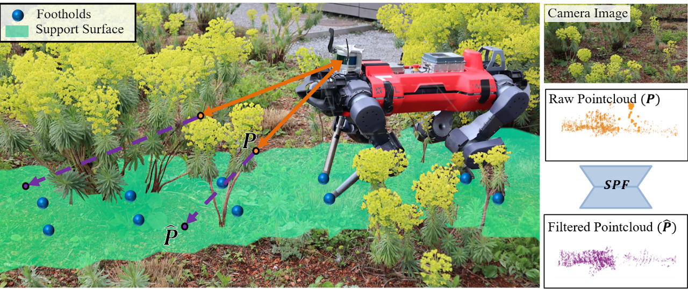

<h1 align="center">
  <br>
  Semantic Pointcloud Filter
  <br>
</h1>

<p align="center">
  
</p>

<p align="center">
  <a href="https://sites.google.com/leggedrobotics.com/semantic-pointcloud-filter?usp=sharing">[Project page]</a> &nbsp; 
  <a href="https://arxiv.org/abs/2305.07995">[Paper]</a> &nbsp; 
  <a href="https://drive.google.com/file/d/1MjcNVJ2iwSdw3h5Z6QahUG4deMm8cr8H/view?usp=sharing">[Data]</a> &nbsp; 
  <a href="https://youtu.be/y56zwSrnJTg">[Video]</a>
</p>



Official implementation of paper **Seeing Through the Grass: Semantic Pointcloud Filter for Support Surface Learning**. Here you can find the code for SPF training and the self-supervised label genration.

## Installation

### Dependencies
create and activate conda environment

```bash
conda env create -f environment.yaml
conda activate spf_venv
```
If you want to visulize the reconstruced support surface created by Gaussian Process, you also need to install the [msgpack-c](https://github.com/msgpack/msgpack-c/tree/cpp_master). And add the [grid_map](https://github.com/ANYbotics/grid_map) packages into your catkin workspace. 

### Install SPF

```bash
cd semantic_front_end_filter
pip install -e .
``` 

## Getting started

### Self-supervised label generation
For the details of how to reconstruct the support surface from the robot feet trajectories, see [here](https://github.com/leggedrobotics/semantic_front_end_filter/tree/public/semantic_front_end_filter/utils/labelling).

### Train model 
For your own robot, you need to raycast the reconstructed support in the camera point of view to get the supervison label for depth estimation. 

You can download our training data from [here](https://drive.google.com/drive/folders/1tRlrYeos8YdGmtDGacB-2Bt_fNqFKyHx), which we build on data collected from Perugia, Italy.

```bash
python semantic_front_end_filter/scripts/train.py --data_path <path-to-data-folder>
```
To validate the trained model, run
```bash
python semantic_front_end_filter/scripts/eval.py --model <path-to-model-folder> --outdir <path-to-save-the-eveluation-plot> --data_path <path-to-data-folder>
```
Our trained model can be downloaded [here](https://drive.google.com/drive/folders/1N1dHvVLqcGxWwW_Jcsr1a0xgog58q9Xg?usp). Please remember to download the whole folder.

## Citing this work
```bibtex
@ARTICLE{qiao23spf,
  author={Li, Anqiao and Yang, Chenyu and Frey, Jonas and Lee, Joonho and Cadena, Cesar and Hutter, Marco},
  journal={IEEE Robotics and Automation Letters}, 
  title={Seeing Through the Grass: Semantic Pointcloud Filter for Support Surface Learning}, 
  year={2023},
  volume={8},
  number={11},
  pages={7687-7694},
  doi={10.1109/LRA.2023.3320016}
 }


